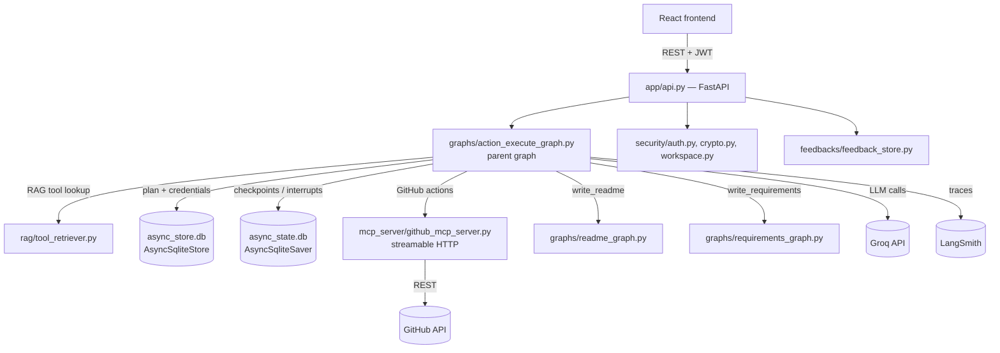

# GitHub Automation Agent — Backend

An agentic backend that turns plain-language goals ("create repo my-project", "write a
readme for my_project folder") into **planned, self-reviewed, and human-approved** GitHub
operations. Built on **LangGraph** for orchestration, **LangChain** + **Groq** for the LLM
calls, an **MCP server** (streamable HTTP transport) for the actual GitHub tool calls, and
**FastAPI** as the HTTP layer consumed by the React frontend.

# Licenced
"Licensed under PolyForm Shield 1.0.0".

---

## Table of contents

- [Architecture](#architecture)
- [Tech stack](#tech-stack)
- [Folder structure](#folder-structure)
- [What each part does](#what-each-part-does)
- [The three graphs](#the-three-graphs)
- [API endpoints](#api-endpoints)
- [Security](#security)
- [Environment variables](#environment-variables)
- [Setup & run](#setup--run)

---

## Architecture



The **parent graph** (`action_execute_graph.py`) is the only graph FastAPI talks to directly.
It plans the work, gets it reviewed by an independent critic step, gets a single human
approval for the whole plan, then executes each step — calling out to the MCP server for
GitHub operations, or `ainvoke`-ing the two child graphs independently for documentation
tasks.

---

## Tech stack

| Layer | Tool |
|---|---|
| Orchestration | LangGraph (`StateGraph`, checkpoints, `interrupt`/`Command`) |
| LLM framework | LangChain (prompts, output parsers) |
| LLM provider | Groq (`openai/gpt-oss-120b`) |
| Observability | LangSmith tracing |
| GitHub operations | Custom MCP server, `streamable_http` transport |
| Tool retrieval | Hybrid RAG — BM25 (`rank_bm25`) + TF-IDF (`scikit-learn`) |
| HTTP API | FastAPI + Uvicorn |
| Auth | JWT (`python-jose`) + bcrypt (`passlib`) |
| Secrets at rest | Fernet symmetric encryption (`cryptography`) |
| Persistence | SQLite via `aiosqlite`, `AsyncSqliteStore` + `AsyncSqliteSaver` (WAL mode) |

---

## Folder structure

```
.
├── app/
│   └── api.py                      # FastAPI app — every HTTP endpoint
├── config/
│   └── logging_config.py           # structured JSONL logger used by all graphs
├── data/
│   └── tools_registry.json         # RAG knowledge base: one entry per GitHub tool
├── databases/
│   ├── async_store.db              # users, credentials, history index, feedback
│   └── async_state.db              # LangGraph checkpoints (conversation/plan state)
├── feedbacks/
│   └── feedback_store.py           # save_feedback / list_all_feedback helpers
├── graphs/
│   ├── action_execute_graph.py     # PARENT graph — plans, reviews, approves, executes
│   ├── readme_graph.py             # child graph — invoked independently for write_readme
│   └── requirements_graph.py       # child graph — invoked independently for write_requirements
├── logs/
│   ├── action_execute_graph.jsonl
│   ├── readme_graph.jsonl
│   ├── requirements_graph.jsonl
│   └── github_mcp_server.jsonl
├── mcp_server/
│   └── github_mcp_server.py        # MCP server exposing GitHub actions as tools
├── rag/
│   └── tool_retriever.py           # HybridToolRetriever (BM25 + TF-IDF)
├── security/
│   ├── auth.py                     # password hashing + JWT
│   ├── crypto.py                   # Fernet encrypt/decrypt for stored secrets
│   └── workspace.py                # per-user path isolation, zip upload/download
├── workspace/                      # per-user project files live here (auto-created)
├── .env                            # see Environment variables
├── Dockerfile
├── dockerfile-compose.yml
├── README.md
└── requirements-additions.txt
```

---

## What each part does

### `app/api.py`
The FastAPI application. Owns the app lifespan (opens the MCP client session, the
`AsyncSqliteStore`, and the compiled graph once at startup; runs an hourly background task
that purges guest workspaces older than 24h). See [API endpoints](#api-endpoints) below.

### `config/logging_config.py`
One shared logger (`action_execute_log`) that every graph node uses. Writes structured
JSON lines to `logs/*.jsonl` — every node's start/end, timing, and any exception. This is
server-side observability only; it is **not** sent to the frontend (see the "why don't I
see this in the UI" note below).

> **Note on logs vs. API responses:** log lines written here (e.g. "Graph Interrupted")
> only ever reach the `logs/` files. The frontend only ever receives what a node explicitly
> returns into `messages` or an `interrupt({...})` payload. If something should be visible
> to the user, it must be added to one of those two places — logging it is not enough.

### `data/tools_registry.json`
The RAG knowledge base — one entry per GitHub tool with `description`, `parameters`,
`required_params`, `path_params`, `keywords`, and `example_goals`. Add a new tool here and
it becomes retrievable with no code changes.

### `databases/`
Two separate SQLite files, both in WAL mode for concurrent FastAPI access:
- **`async_store.db`** — key/value store (`AsyncSqliteStore`): user accounts, encrypted
  credentials, per-user thread/goal history index, feedback entries.
- **`async_state.db`** — LangGraph checkpoints (`AsyncSqliteSaver`): the full conversation
  state per `thread_id`, including paused `interrupt()` points, so a task can be resumed
  exactly where it left off.

### `feedbacks/feedback_store.py`
`save_feedback()` / `list_all_feedback()`. `goal`, `username`, and `goal_achieved` are
always filled in server-side from the thread's own state — never trusted from the client.

### `graphs/`
See [The three graphs](#the-three-graphs).

### `mcp_server/github_mcp_server.py`
An MCP server (Model Context Protocol) exposing GitHub operations — `create_repo`,
`delete_repo`, `list_repos`, `list_repo_files`, `push_folder`, `pull_repo` — as callable
tools over **streamable HTTP transport**. The parent graph connects to it once at startup
as an MCP client (`streamable_http_client` + `ClientSession`) and calls
`session.call_tool(name=..., arguments=...)` for every non-documentation action.

### `rag/tool_retriever.py`
`HybridToolRetriever` — combines BM25 (lexical) and TF-IDF (vector-ish) similarity scores
to retrieve only the tools relevant to a given goal, instead of dumping the entire
registry into every prompt. Also generates the bilingual (English + Hinglish) usage guide
shown during the clarification loop.

### `security/`
- **`auth.py`** — bcrypt password hashing, JWT issue/verify (24h expiry), account storage.
- **`crypto.py`** — Fernet encryption/decryption for GitHub tokens and Groq API keys at rest.
- **`workspace.py`** — resolves every path under `workspace/{owner_id}/`, blocking path
  traversal and zip-slip; handles zip extraction/creation and the 24h guest-workspace cleanup.

### `workspace/`
Per-user (or per-guest) project files, uploaded as `.zip` via the API and used as the
`folder_name` for `write_readme` / `write_requirements`, or as `workspace_folder_name` for
`push_folder`. Structure: `workspace/{username_or_guest_id}/{project_name}/...`.

---

## The three graphs

**`action_execute_graph.py` (parent)** — the only graph the API calls directly:

```
check_goal → (missing params?) → clarify (interrupt, max 3 tries) → back to check_goal
           → (params ok) → critic (independent LLM review, max 3 tries) → back to check_goal on reject
           → (critic approves) → human_approval (ONE interrupt, full plan) → yes → execute all → END
                                                                            → else → cancelled, END
```

- Deterministic required-parameter validation (not LLM self-report) is what actually
  prevents hallucinated/incomplete plans.
- The critic node is a second, independent LLM call whose only job is to reject plans that
  are wrong — it never invents actions or values itself.
- Exactly one human interrupt for approval, showing the entire plan at once.

**`readme_graph.py`** and **`requirements_graph.py`** — independent graphs, each with their
own checkpointer, `ainvoke`d directly from inside `action_execute_node` when the plan calls
for `write_readme` / `write_requirements`. They scan the target folder in `workspace/`,
read file contents, and produce a `final_answer` (the generated README / requirements.txt),
which the parent graph then returns as a message.

---

## API endpoints

| Endpoint | Auth | Purpose |
|---|---|---|
| `POST /auth/signup` | — | Create account; GitHub token + Groq API key collected here |
| `POST /auth/login` | — | Returns a JWT (24h expiry) |
| `POST /goal/start` | JWT | Start a new goal → new `thread_id` |
| `POST /goal/resume` | JWT | Reply to a pending clarification/approval |
| `POST /demo/start` / `/demo/resume` | — | `write_readme` / `write_requirements` only, no signup |
| `GET /history` / `/history/{thread_id}` | JWT | Past goals for the current user |
| `POST /files/upload`, `GET /files/list`, `GET /files/download/{p}`, `DELETE /files/{p}` | JWT | Per-user workspace zip management |
| `POST /demo/files/*` | guest_id | Same, for demo sessions |
| `POST /feedback` | JWT or guest_id | `goal`/`username`/`goal_achieved` auto-filled |
| `GET /all_feedbacks` | — | Public feed |
| `GET /health` | — | Liveness check |

---

## Security

- GitHub tokens and Groq API keys are **encrypted at rest** (Fernet) and only decrypted
  in-memory per request.
- Passwords are **bcrypt-hashed**, never stored in plain text.
- Sessions are **JWT**, 24-hour expiry.
- Every file path is resolved through `security/workspace.py`, which blocks path traversal
  and zip-slip and confines all activity to `workspace/{owner_id}/`.
- Nothing executes without one explicit, full-plan human approval.
- Guest (demo) workspaces are purged automatically after 24 hours.

---

## Environment variables

Create a `.env` file in the project root:

```env
GROQ_API_KEY=owner_fallback_groq_key_for_demo_mode

# Fernet key — generate with:
#   python -c "from cryptography.fernet import Fernet; print(Fernet.generate_key().decode())"
APP_ENCRYPTION_KEY=

# JWT signing secret — generate with:
#   python -c "import secrets; print(secrets.token_urlsafe(48))"
JWT_SECRET_KEY=

MCP_SERVER_URL=http://localhost:8080/mcp
FRONTEND_ORIGIN=http://localhost:5173

# Optional — LangSmith tracing
LANGCHAIN_TRACING_V2=true
LANGCHAIN_API_KEY=
LANGCHAIN_PROJECT=github-automation-agent
```

---

## Setup & run

```bash
# 1. Install dependencies
pip install -r requirements-additions.txt --break-system-packages

# 2. Configure .env (see above)

# 3. Start the MCP server (GitHub tools) — separate process, must be up first
python mcp_server/github_mcp_server.py
# serves streamable HTTP at http://localhost:8080/mcp

# 4. Start the FastAPI app
uvicorn app.api:app --reload --port 8000
```

Databases (`databases/async_store.db`, `databases/async_state.db`) and the `workspace/`
and `logs/` directories are created automatically on first run.

---

**Author:** [ajaysah-ai](https://github.com/ajaysah-ai/) — [LinkedIn](https://www.linkedin.com/in/ajaysah-ai/)